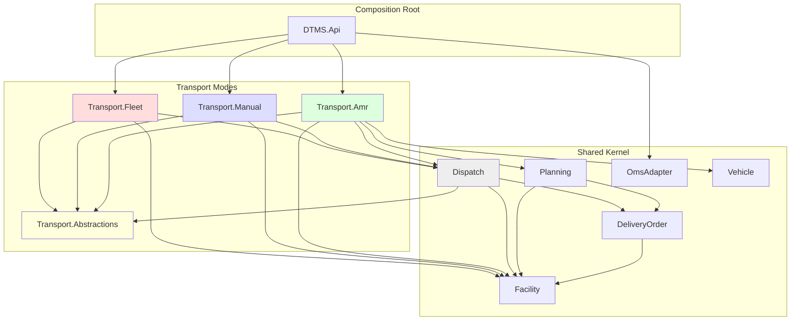
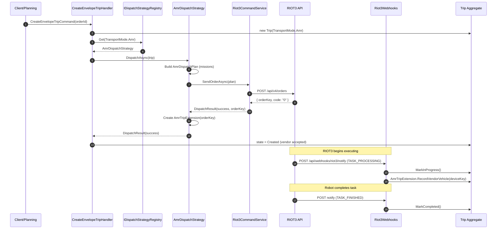
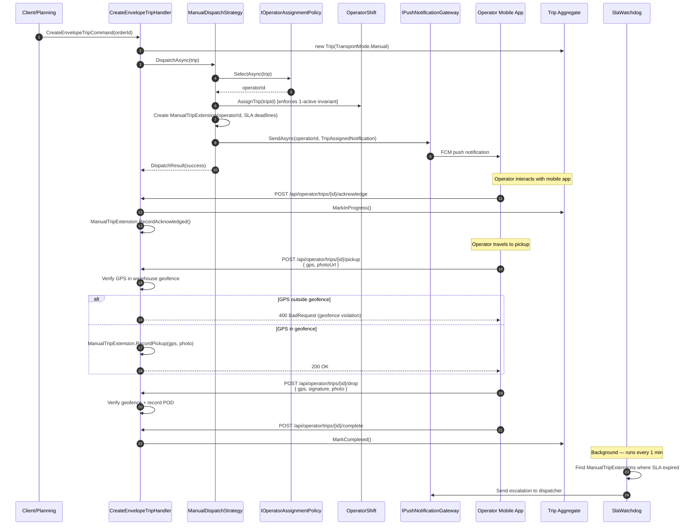
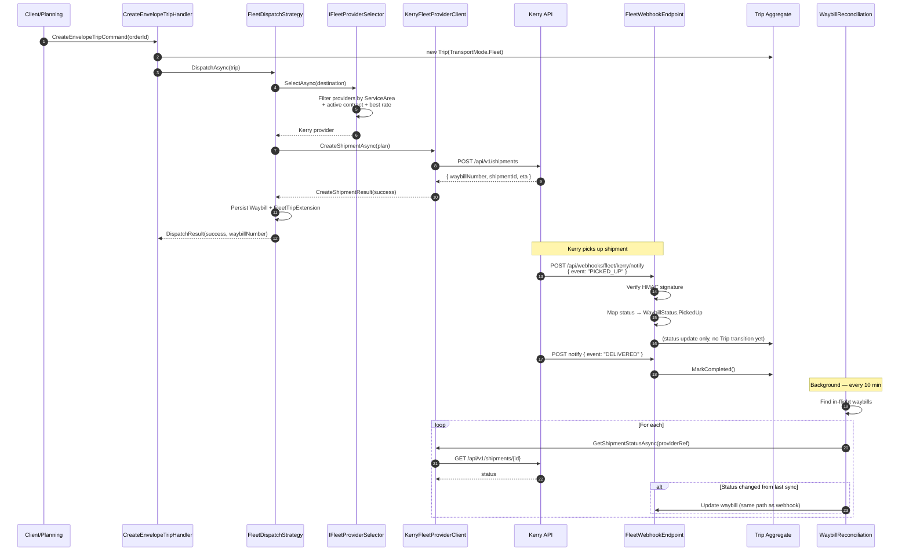
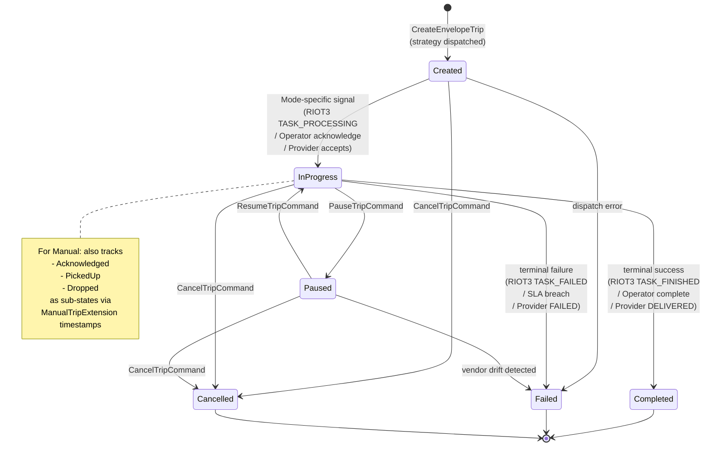
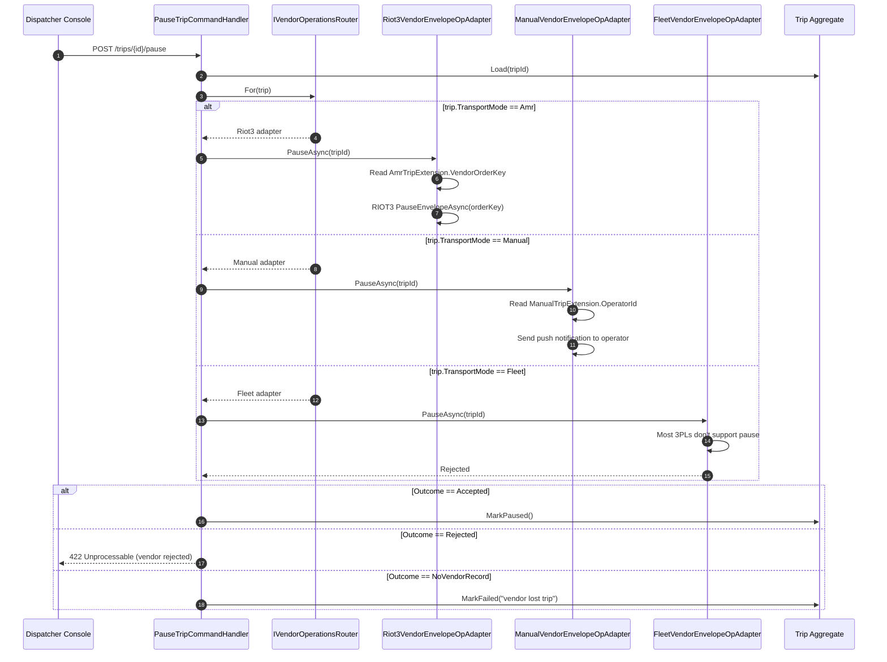
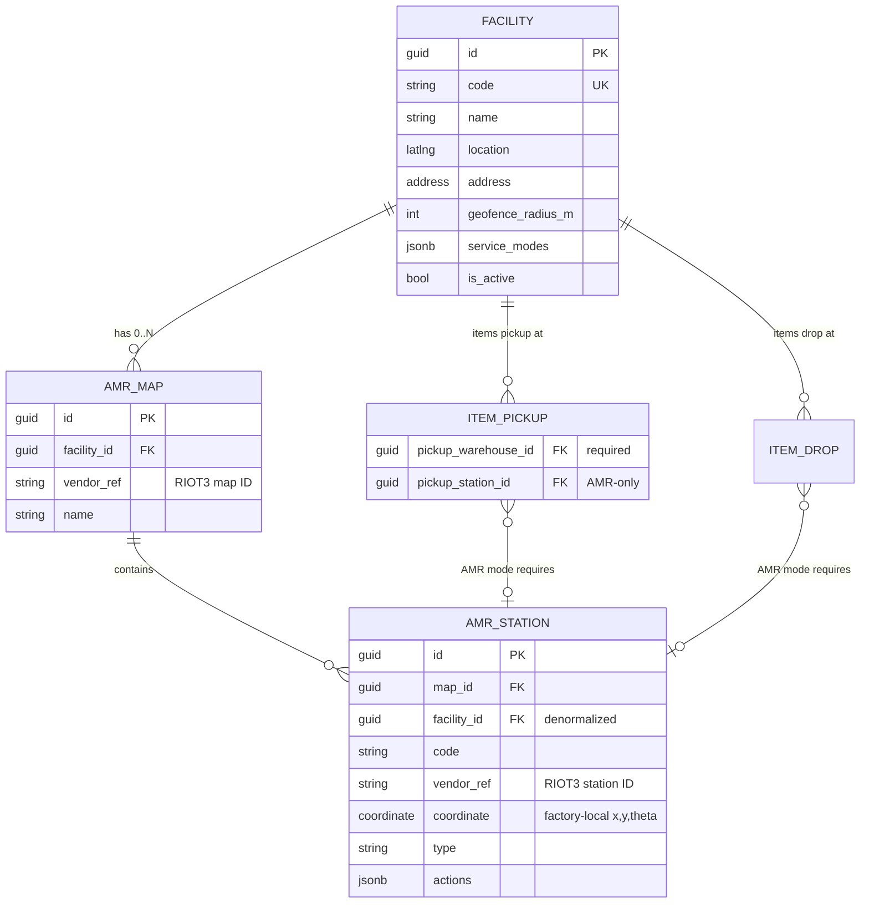

# Architecture Diagrams

Mermaid diagrams สำหรับ multi-mode transport architecture หลัง Phase 5

## 1. Module Dependency Graph



**Key rules:**
- `Dispatch` reference only `Transport.Abstractions` — ไม่รู้จัก concrete mode implementations
- `Transport.{Amr,Manual,Fleet}` ไม่ reference กัน
- `Transport.*` reference `Transport.Abstractions` + shared kernel
- `Api` (composition root) reference all transport modes ผ่าน `AddTransport*()` extensions

## 2. AMR Dispatch Flow (Existing — preserved)



## 3. Manual Dispatch Flow (NEW Phase 4)



## 4. Fleet Dispatch Flow (NEW Phase 5)



## 5. Trip FSM (Shared across all modes)



## 6. Pause/Resume Router Flow (Mode-Agnostic)



## 7. Facility / AmrStation Hierarchy



## 8. Trip Extension Tables

```mermaid
erDiagram
    TRIP ||--o| AMR_TRIP_EXT : "if mode=Amr"
    TRIP ||--o| MANUAL_TRIP_EXT : "if mode=Manual"
    TRIP ||--o| FLEET_TRIP_EXT : "if mode=Fleet"

    TRIP {
        guid id PK
        guid order_id FK
        string transport_mode "discriminator"
        string status
        guid pickup_warehouse_id FK
        guid drop_warehouse_id FK
        guid pickup_station_id FK "nullable"
        guid drop_station_id FK "nullable"
        guid vehicle_id FK "nullable"
    }

    AMR_TRIP_EXT {
        guid trip_id PK_FK
        string vendor_order_key
        string vendor_vehicle_key
        string vendor_vehicle_name
        string vendor_pause_source
        jsonb vendor_request_snapshot
    }

    MANUAL_TRIP_EXT {
        guid trip_id PK_FK
        guid assigned_operator_id FK
        guid operator_shift_id FK
        timestamp acknowledged_at
        timestamp pickup_verified_at
        timestamp drop_verified_at
        latlng pickup_gps
        latlng drop_gps
        string pod_photo_url
        string pod_signature_url
        timestamp expected_pickup_by
        timestamp expected_drop_by
    }

    FLEET_TRIP_EXT {
        guid trip_id PK_FK
        guid waybill_id FK
        guid provider_id FK
        string waybill_number
        string tracking_url
        timestamp estimated_arrival_at
    }
```

## 9. End-to-End: 3 Orders Parallel

```mermaid
gantt
    title 3 Orders Dispatched Simultaneously
    dateFormat HH:mm
    axisFormat %H:%M

    section Order 1 (AMR)
    Create order            :done, a1, 10:00, 1m
    Dispatch (Riot3)        :done, a2, after a1, 1m
    RIOT3 executes          :done, a3, after a2, 8m
    Webhook complete        :done, a4, after a3, 1m

    section Order 2 (Manual)
    Create order            :done, m1, 10:01, 1m
    Assign operator + push  :done, m2, after m1, 1m
    Operator ack            :done, m3, after m2, 3m
    Drive to pickup         :done, m4, after m3, 5m
    Pickup (geofence + POD) :done, m5, after m4, 2m
    Drive to drop           :done, m6, after m5, 10m
    Drop (POD)              :done, m7, after m6, 2m
    Complete                :done, m8, after m7, 1m

    section Order 3 (Fleet)
    Create order            :done, f1, 10:02, 1m
    Select Kerry            :done, f2, after f1, 1m
    POST shipment           :done, f3, after f2, 1m
    Webhook PICKED_UP       :done, f4, 12:00, 1m
    Webhook IN_TRANSIT      :done, f5, after f4, 4h
    Webhook DELIVERED       :done, f6, 16:00, 1m
```



> All 3 trips share Trip table + projections + dispatcher console — different code paths for vendor ops, same FSM
