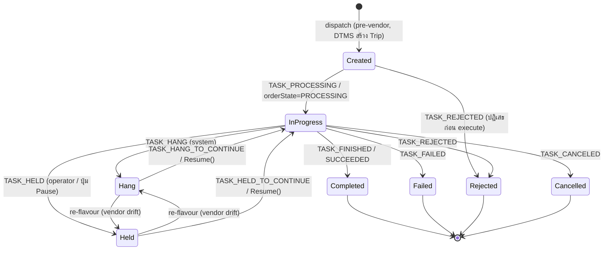
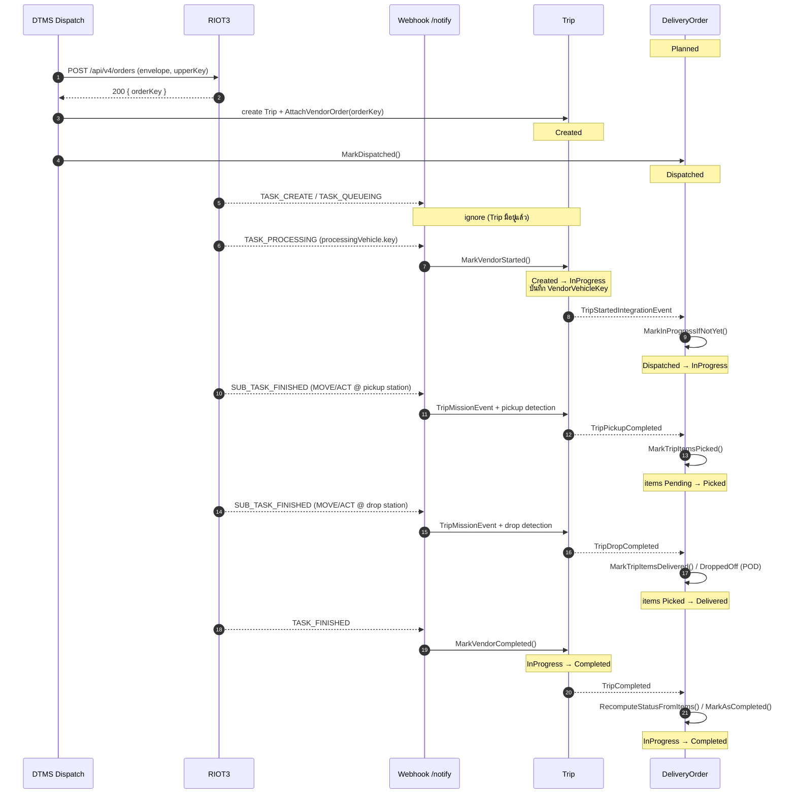
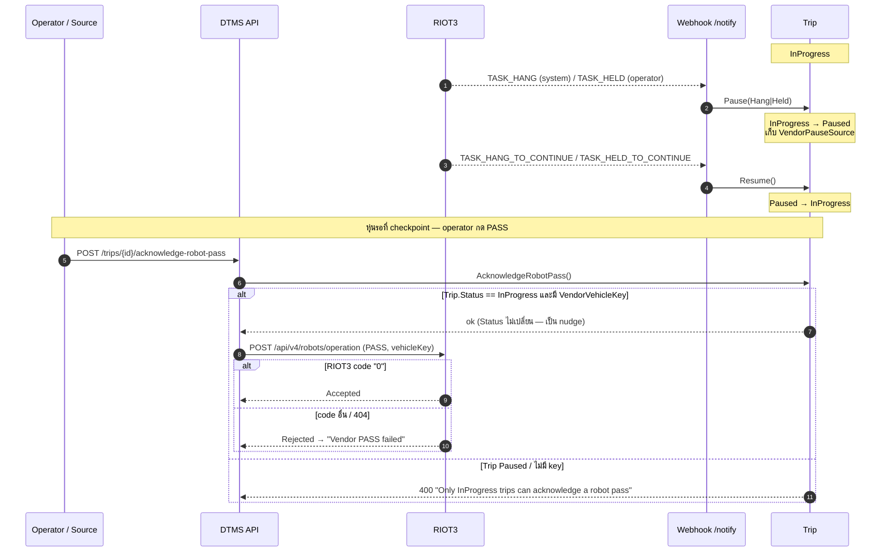
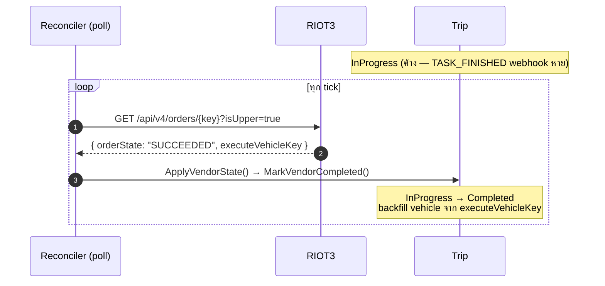
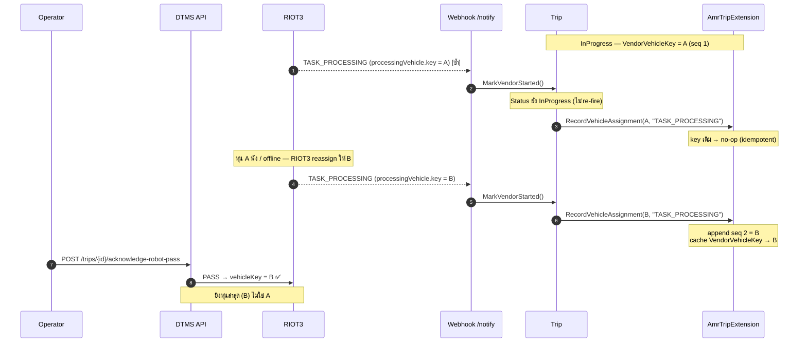
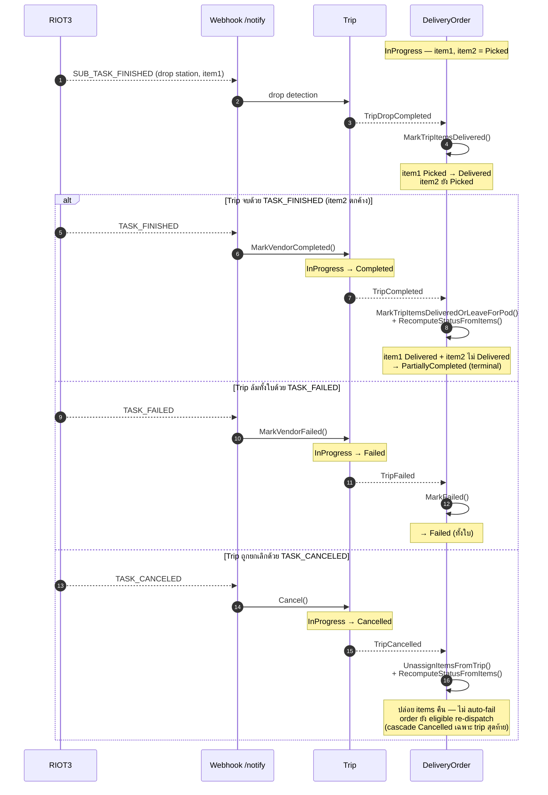

# RIOT3 ↔ DTMS Lifecycle Reference

> **จุดประสงค์:** map สถานะระหว่าง RIOT3 (vendor) กับ DTMS (`Trip.Status`, `TripMissionEvent`,
> Fleet vehicle state, `DeliveryOrder`) ให้อยู่ที่เดียว ใช้ debug / ออกแบบ guard / อ่าน webhook
>
> **หลักการสำคัญ:** `Trip.Status` เป็น **lossy projection** ของ RIOT3 — RIOT3 มี ~11 task events,
> 2 vocabulary (notify vs order-query), และ 3 ระดับ (order / mission / vehicle) แต่ DTMS ยุบ
> ระดับ order เหลือ **6 สถานะ** ส่วน mission กับ vehicle แยกเก็บคนละที่ ไม่ยุบเข้า `Trip.Status`

---

## ภาพรวม 4 ชั้น

```
┌─ RIOT3 (vendor) ────────────────────────────┐      ┌─ DTMS ───────────────────────────────┐
│                                              │      │                                       │
│  Level 1  Order    (task.state / orderState) │ ───► │  Trip.Status  (6 ค่า)                 │
│  Level 2  Mission  (SUB_TASK_*)              │ ───► │  TripMissionEvent  (timeline)         │
│  Level 3  Vehicle  (systemState / eStop)     │ ───► │  Fleet VehicleState  (ไม่แตะ Trip)    │
│                                              │      │                                       │
└──────────────────────────────────────────────┘     │      Trip domain events               │
                                                      │            │                          │
                                                      │            ▼                          │
                                                      │  DeliveryOrder.Status + ItemStatus    │
                                                      └───────────────────────────────────────┘
```

Webhook เข้าจุดเดียว: `POST /api/webhooks/riot3/notify/{secret?}` แล้วแยกด้วย `payload.Type`
(`task` / `subtask` / `vehicle`) → `Riot3Webhooks.cs`

---

## Level 1 — Order ↔ `Trip.Status`

`Trip.Status` มี 8 ค่า: `Created, InProgress, Hang, Held, Completed, Failed, Cancelled, Rejected`
(`DispatchEnums.cs`)
- `Rejected` เพิ่ม 2026-07-28: vendor ปฏิเสธก่อนได้ execute (แยกจาก `Failed` = ทำแล้วล้ม)
  ฝั่ง DeliveryOrder ตอบสนองเหมือน Failed ทุกประการ
- `Hang`/`Held` แทน `Paused` เดิม (แยก 2026-07-28): `Hang` = ระบบหยุดเอง (TASK_HANG),
  `Held` = คนสั่งหยุด (TASK_HELD / ปุ่ม Pause) — status เป็น source of truth ของคำสั่ง resume
  (`CONTINUE_FROM_HANG` vs `CONTINUE_FROM_HELD`, สลับกันโดน E639999); รองรับ **re-flavour**
  เมื่อ vendor เปลี่ยน HANG↔HELD กลางทาง (event ติดธง Reflavour, PauseCount ไม่บวกซ้ำ)

RIOT3 พูดถึง order ด้วย **2 vocabulary ที่ไม่ตรงกัน**:
- **notify webhook** → field `taskEventType` (เช่น `TASK_FINISHED`)
- **order-query GET** `/api/v4/orders/{key}?isUpper=true` → field `orderState` (เช่น `SUCCEEDED`)
  ใช้โดย reconciler poller เป็น safety-net เวลา webhook หาย

| RIOT3 notify (`taskEventType`) | RIOT3 query (`orderState`) | Trip method | `Trip.Status` ผลลัพธ์ |
|---|---|---|---|
| `TASK_CREATE`   | `CREATE`    | *(ignore)* | คง `Created` |
| `TASK_QUEUEING` | `QUEUEING`  | *(ignore)* | คง `Created` |
| `TASK_PROCESSING` | `PROCESSING` | `MarkVendorStarted()` | **`InProgress`** |
| `TASK_FINISHED` | **`SUCCEEDED`** ⚠️ | `MarkVendorCompleted()` | **`Completed`** |
| `TASK_FAILED`   | `FAILED`    | `MarkVendorFailed()` | **`Failed`** |
| `TASK_REJECTED` | `REJECTED`  | `MarkVendorRejected()` | **`Rejected`** |
| `TASK_CANCELED` | **`CANCELLED`** ⚠️ | `Cancel()` | **`Cancelled`** |
| `TASK_HANG`     | `HANG`      | `Pause(Hang)` | **`Hang`** |
| `TASK_HELD`     | `HELD`      | `Pause(Held)` | **`Held`** |
| `TASK_HANG_TO_CONTINUE` | *(กลับเป็น `PROCESSING`)* | `Resume()` | **`InProgress`** |
| `TASK_HELD_TO_CONTINUE` | *(กลับเป็น `PROCESSING`)* | `Resume()` | **`InProgress`** |

⚠️ = vocabulary drift ระหว่าง 2 ช่องทาง — code ทั้ง webhook และ reconciler ต้องรับทั้งคู่
(`FINISHED`/`SUCCEEDED`, `CANCELED`/`CANCELLED`) ไม่งั้น reconciler จะมองไม่เห็น completion

### State diagram



### หมายเหตุพฤติกรรมสำคัญ

- **`Created` เป็น state ฝั่ง DTMS ล้วน** — เกิดตอนสั่ง dispatch ก่อน webhook ตัวแรกมา ไม่มี
  RIOT3 event ไหน map กลับมาเป็น `Created`. RIOT3 `CREATE`/`QUEUEING` ถูก **ignore** เพราะ Trip
  มีอยู่แล้ว (`Riot3Webhooks.cs` default case)
- **`TASK_PROCESSING` = allocation ไม่ใช่การลงมือทำ mission จริง** — order ถูก commit ให้หุ่นและ
  เข้าสถานะ running แต่หุ่นอาจยังไม่ขยับ. สัญญาณ "หุ่นทำ mission จริง" คือ Level 2 (`SUB_TASK_PROCESSING`)
  / Level 3 (`systemState=BUSY`)
- **`MarkVendorStarted()` flip status แค่ครั้งแรก** (`Created → InProgress`). `TASK_PROCESSING` ซ้ำ
  จะ **ไม่** re-fire event แต่ยังอัปเดต vehicle assignment (ดู reassignment ด้านล่าง)
- **Pause 2 flavor แยก status เต็มตัวแล้ว (2026-07-28)** — `Hang`/`Held` ตรงตาม vendor;
  resume เลือกคำสั่งจาก status ตรง ๆ (ส่งผิดได้ error `E639999`) `VendorPauseSource` เขียนคู่ขนาน
  ไว้เป็น rollback path 1 release แล้วจะ drop; แถวประวัติ `toStatus="Paused"` ยุคเก่าคงไว้ตามเดิม
- **Failure 3 flavor แยกสถานะครบ (ตั้งแต่ 2026-07-28)** → `TASK_FAILED` เป็น `Failed` (ทำแล้วล้ม);
  `TASK_REJECTED` เป็น `Rejected` (ปฏิเสธก่อนได้ทำ — order ยัง propagate เป็น Failed เหมือนกัน,
  retry ผ่าน Reopen ได้เหมือนกัน); `TASK_CANCELED` เป็น `Cancelled` (ปล่อย DeliveryOrder ให้ re-dispatch ได้)
- **First-terminal-failure-wins** — `MarkVendorFailed`/`MarkVendorRejected` no-op เมื่อ Trip อยู่
  terminal ใดแล้ว (`Failed`/`Rejected`/`Cancelled`): webhook กับ reconciler ส่ง terminal ขัดกันได้
  ตัวที่มาทีหลังห้าม flip status หรือยิง order-failing event ซ้ำ **รวมถึง fix เดิม:
  `TASK_FAILED` ที่มาช้าหลัง operator cancel จะไม่ทับ `Cancelled` เป็น `Failed` อีกต่อไป**
  (เดิมทับได้ → order โดนลาก Failed ทั้งที่ cancel ปล่อย items คืนแล้ว)

### Vehicle reassignment (VendorVehicleKey เปลี่ยนได้ระหว่างทาง)

RIOT3 reassign หุ่นได้ (หุ่น A พัง → หุ่น B). ทุก `TASK_PROCESSING` เรียก
`AmrTripExtension.RecordVehicleAssignment()`:
- append เข้า history (`AmrVehicleAssignment`) + อัปเดต cache `VendorVehicleKey` (last-write-wins)
- idempotent — key+name เดิม = no-op
- **PASS / CANCEL ยิงไปที่ `VendorVehicleKey` (cache) ซึ่งเป็นตัวล่าสุดเสมอ**
- payload มี `appointVehicleKey` (หุ่นที่ระบุเจาะจง) แยกจาก `processingVehicle` (หุ่นที่ execute) —
  DTMS เก็บเฉพาะ `processingVehicle`

> ⚠️ **Gap:** การอัปเดต key พึ่ง webhook ล้วน ๆ ถ้า RIOT3 reassign แล้วไม่ส่ง `TASK_PROCESSING`
> ใหม่ (หรือ DTMS drop) → cache ค้าง (stale) → PASS ยิงหุ่นเก่า. reconciler poller ช่วย self-heal
> จาก `ResolvedVehicle` ของ order-query แต่เป็นการ poll ไม่ใช่ real-time

---

## Level 2 — Mission ↔ `TripMissionEvent`

`SUB_TASK_*` events **ไม่แตะ `Trip.Status`** — เก็บเป็น `TripMissionEvent` ไว้ทำ Mission Timeline
ใน operator drawer (`Riot3Webhooks.HandleSubTaskEvent`)

| RIOT3 (`taskEventType`) | `TripMissionEvent.State` |
|---|---|
| `SUB_TASK_PROCESSING` | `PROCESSING` |
| `SUB_TASK_FINISHED`   | `FINISHED` |
| `SUB_TASK_FAILED`     | `FAILED` |
| `SUB_TASK_CANCELED`   | `CANCELED` |

- mission type: `MOVE` (เคลื่อนที่) | `ACT` (ทำ action เช่น lift/load/dispense)
- **Pickup/Drop detection:** เมื่อ `MOVE`/`ACT` = `FINISHED` ที่ pickup หรือ drop station จะ fire
  domain event ให้ฝั่ง DeliveryOrder flip item status (ดู Level 4). resolve station ด้วย vendor
  station id (`VendorRef`) ไม่ใช่ชื่อ (RIOT3 casing ต่าง)
- idempotent ที่ repo: `UNIQUE (TripId, MissionKey, State)` — webhook ซ้ำ / reconciler upsert ซ้ำได้

---

## Level 3 — Vehicle ↔ Fleet (ไม่แตะ `Trip.Status`)

`vehicle` events emit เป็น integration event ไป Fleet module เท่านั้น **ไม่ผูกกับ Trip**
(`Riot3Webhooks.HandleVehicleEvent`)

| RIOT3 `systemState` | canonical (Fleet) |
|---|---|
| `IDLE` | `Idle` |
| `BUSY` / `RUNNING` / `EXECUTING` | `Moving` |
| `ERROR` | `Error` |
| `CHARGING` | `Charging` |
| *(อื่น ๆ)* | `Offline` |

- → `VehicleStateChangedIntegrationEvent` (+ battery %)
- `safetyState.eStop != "NONE"` (AUTOACK/MANUAL/REMOTE) = **emergency** → ปัจจุบัน **`LogWarning`
  เฉย ๆ** ไม่ผูกกับ Trip/PASS
- battery < 20% → `VehicleBatteryLowIntegrationEvent`

> ⚠️ **Gap (emergency vs PASS):** eStop / suspend มาทางช่องนี้ ซึ่ง **ไม่ map เข้า `Trip.Status`**
> ดังนั้น guard ของ `AcknowledgeRobotPass` (ที่เช็คแค่ `Status == InProgress`) มองไม่เห็น emergency
> ที่ไม่ได้ถูก mirror เป็น `TASK_HANG`. หุ่นโดน E-stop แต่ order ยังไม่ HANG → PASS ยิงออกได้ แล้วไป
> พึ่ง RIOT3 ปฏิเสธ. ถ้าจะอุด: เก็บ eStop/systemState ลง field ที่ผูกกับ trip/หุ่น แล้วให้ guard เช็คด้วย

---

## Level 4 — Trip → `DeliveryOrder` propagation

Trip fire domain/integration event → consumer ฝั่ง DeliveryOrder ขับ `OrderStatus` + `ItemStatus`

### OrderStatus flow (เต็ม)

```
Draft → Submitted → Validated → Confirmed → Planning → Planned → Dispatched → InProgress
                                                                                   │
                                              ┌────────────────────────────────────┤
                                              ▼            ▼               ▼        ▼
                                          Completed  PartiallyCompleted  Failed  (Cancelled)
```
ค่าอื่น: `Held` (block ชั่วคราว), `Cancelled`, `Rejected` (`OrderStatus.cs`)

### ItemStatus flow

```
Pending → Picked → DroppedOff → Delivered        (+ Failed, Returned, Cancelled)
                └─(ไม่ต้อง POD)──► Delivered
```

### Trip event → DeliveryOrder consumer

| Trip event / signal | Consumer | ทำอะไรกับ DeliveryOrder |
|---|---|---|
| `TripStartedIntegrationEvent` (จาก `MarkVendorStarted`) | `TripStartedConsumer` | `MarkInProgressIfNotYet()` → `Dispatched → InProgress` |
| Pickup ที่ pickup station | `TripPickupCompletedConsumer` | `MarkTripItemsPicked()` → items `Pending → Picked` |
| Drop ที่ drop station | `TripDropCompletedConsumer` | POD required: `Picked → DroppedOff`; ไม่ต้อง POD: `Picked → Delivered` |
| `TripCompleted` (จาก `MarkVendorCompleted`) | `TripCompletedConsumer` | `MarkTripItemsDeliveredOrLeaveForPod()` + `RecomputeStatusFromItems()` / `MarkAsCompleted()` → `Completed` / `PartiallyCompleted` / `Failed` |
| `TripFailed` (จาก `MarkVendorFailed`) | `TripFailedConsumer` | `MarkFailed()` → `Failed` |
| `TripRejected` (จาก `MarkVendorRejected`) | `TripFailedConsumer` (handler เดียวกัน) | เหมือน `TripFailed` ทุกประการ — ต่างแค่ Trip.Status/history/facts บันทึกเป็น `Rejected` |
| `TripCancelled` (จาก `Cancel`) | `TripCancelledConsumer` | ปล่อย items ออกจาก trip (`UnassignItemsFromTrip`) + `RecomputeStatusFromItems()`; **ไม่ auto-fail** — order ยัง eligible re-dispatch. cascade เป็น `Cancelled` เฉพาะเมื่อเป็น trip สุดท้ายและ order ยัง in-flight |

หมายเหตุ:
- `PartiallyCompleted` = terminal เมื่อ ≥1 item `Delivered` และ ≥1 item ไม่ `Delivered` ตอน trip จบ
- `TripCancelled` ต่างจาก `TripFailed`: cancel ไม่ทำ order เป็น Failed (ให้ re-dispatch), fail propagate ไป Failed

---

## Sequence — ตัวอย่าง flow จริง (end-to-end)

### A. Happy path: dispatch → pickup → drop → complete



> **จุดสังเกต:** `Trip.Status` เปลี่ยนแค่ 2 ครั้ง (`Created→InProgress→Completed`) — pickup/drop
> เป็น item-level ไม่แตะ `Trip.Status`. ถ้ามีบาง item ไม่ถึง drop ตอน `TASK_FINISHED`
> → `RecomputeStatusFromItems()` ให้ order เป็น `PartiallyCompleted` แทน `Completed`

### B. Branch: pause / resume + operator PASS



> **จุดสังเกต:** PASS เป็น nudge — `Trip.Status` ไม่เปลี่ยน. guard เห็นแค่ pause ที่มาทาง order
> channel (`TASK_HANG`/`TASK_HELD`). ถ้าหุ่นโดน **E-stop** (Level 3 vehicle) แต่ order ยังไม่ HANG
> → `Status` ยังเป็น `InProgress` → PASS ยิงออกได้ แล้วไปพึ่ง RIOT3 ปฏิเสธ (ดู Known gaps #1)

### C. Safety-net: reconciler เมื่อ webhook หาย



> **จุดสังเกต:** reconciler อ่าน `orderState` (vocab คนละชุด — `SUCCEEDED` ไม่ใช่ `FINISHED`) และ
> backfill `VendorVehicleKey` จาก `ResolvedVehicle` เมื่อ `TASK_PROCESSING` เดิมหาย

### D. Reassignment: หุ่น A พัง → หุ่น B รับช่วง



> **จุดสังเกต:** status ไม่เปลี่ยน (flip แค่ครั้งแรกตอน Created→InProgress) — reassignment แค่ต่อ
> history + ขยับ cache pointer. PASS/CANCEL อ่าน cache `VendorVehicleKey` จึงยิงหุ่น B เสมอ.
> ถ้า `TASK_PROCESSING` ของ B **หาย** → cache ค้างที่ A → reconciler self-heal จาก
> `ResolvedVehicle` (source = `VehicleReconciled`) ดู Known gaps #2

### E. Cancel / Fail → item propagate เป็น PartiallyCompleted

Multi-item order (item1, item2): pickup ทั้งคู่ → item1 ถึง drop สำเร็จ แต่ item2 ไม่ถึง



> **จุดสังเกต:** 3 ปลายทางต่างกันชัด —
> **`TASK_FINISHED` + item ตกค้าง → `PartiallyCompleted`** (order ยังนับว่าจบงาน),
> **`TASK_FAILED` → `Failed` ทั้งใบ** (propagate ไป order),
> **`TASK_CANCELED` → ปล่อย items คืน ไม่ fail** (ให้ re-dispatch). `PartiallyCompleted` เกิดจาก
> `RecomputeStatusFromItems()` เมื่อมี ≥1 item `Delivered` และ ≥1 item ไม่ `Delivered` ตอน trip จบ

---

## Known gaps / caveats (สรุป)

1. **Emergency ↔ PASS** — eStop/suspend อยู่ Level 3 (vehicle) ไม่ map เข้า `Trip.Status` → guard
   ของ PASS มองไม่เห็น (ดู Level 3)
2. **Vehicle key stale** — reassignment พึ่ง `TASK_PROCESSING` webhook; หายเมื่อไหร่ cache ค้าง →
   PASS/CANCEL อาจยิงหุ่นผิด (reconciler self-heal แบบ poll)
3. **Vocabulary drift** — `FINISHED`/`SUCCEEDED`, `CANCELED`/`CANCELLED` ต้องรับทั้งคู่ทุกที่ที่อ่าน state
4. **Webhook loss** — ทุก transition พึ่ง webhook; reconciler poller (`Riot3ReconciliationService`)
   เป็น safety-net อ่าน order-query แล้ว re-apply. **ตั้งแต่ 2026-07-29 มี alert คุมช่องทางเงียบ**:
   `Riot3NotifyChannelSilent` (P1) fire เมื่อไม่มีเฟรม notify ใด ๆ เกิน 3 นาทีขณะมี trip in-flight
   (`ops/prometheus/rules/webhook-silence.yml` — บทเรียนจาก outage 24 ก.ค. ที่เงียบ 2.5 ชม. โดยไม่มีใครรู้)
5. **`Trip.Status` หยาบ** — อยากรู้ "หุ่นทำ mission จริง" ต้องอ่าน Level 2/3 ไม่ใช่ `Trip.Status`

---

## Source of truth (file references)

| หัวข้อ | ไฟล์ |
|---|---|
| Webhook dispatch (3 levels) | `src/Modules/Transport.Amr/DTMS.Transport.Amr/Webhooks/Riot3Webhooks.cs` |
| RIOT3 notify payload (event list) | `src/Modules/Transport.Amr/DTMS.Transport.Amr/Models/Riot3NotifyPayload.cs` |
| RIOT3 order-query (orderState vocab) | `src/Modules/Transport.Amr/DTMS.Transport.Amr/Models/Riot3OrderQueryResponse.cs` |
| Reconciler (orderState → transition) | `src/Modules/Transport.Amr/DTMS.Transport.Amr/Services/Riot3ReconciliationService.cs` |
| `Trip.Status` enum + `VendorPauseSource` | `src/Modules/Dispatch/DTMS.Dispatch.Domain/Enums/DispatchEnums.cs` |
| Trip domain transitions | `src/Modules/Dispatch/DTMS.Dispatch.Domain/Entities/Trip.cs` |
| Vehicle assignment / reassignment | `src/Modules/Dispatch/DTMS.Dispatch.Domain/Entities/AmrTripExtension.cs` |
| `OrderStatus` / `ItemStatus` enum | `src/Modules/DeliveryOrder/DTMS.DeliveryOrder.Domain/Enums/OrderStatus.cs`, `ItemStatus.cs` |
| DeliveryOrder transitions | `src/Modules/DeliveryOrder/DTMS.DeliveryOrder.Domain/Entities/DeliveryOrder.cs` |
| Trip→Order consumers | `src/Modules/DeliveryOrder/DTMS.DeliveryOrder.Application/Consumers/Trip*Consumer.cs` |
